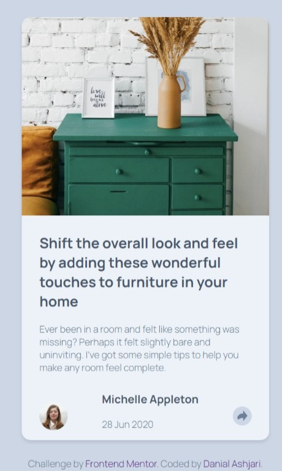

# Frontend Mentor - Article preview component solution

This is a solution to the [Article preview component challenge on Frontend Mentor](https://www.frontendmentor.io/challenges/article-preview-component-dYBN_pYFT). Frontend Mentor challenges help you improve your coding skills by building realistic projects.

## Table of contents

- [Overview](#overview)
  - [The challenge](#the-challenge)
  - [Screenshot](#screenshot)
  - [Links](#links)
- [My process](#my-process)
  - [Built with](#built-with)
  - [What I learned](#what-i-learned)
  - [Continued development](#continued-development)
  - [Useful resources](#useful-resources)
- [Author](#author)

## Overview

### The challenge

Users should be able to:

- View the optimal layout for the component depending on their device's screen size
- See the social media share links when they click the share icon

### Screenshot




### Links

- Solution URL: [Add solution URL here](https://your-solution-url.com)
- Live Site URL: [Add live site URL here](https://your-live-site-url.com)

## My process

### Built with

- HTML
- SCSS
- Flexbox
- JS
- Mobile-first workflow

### What I learned

adding event listener, and also using css to creat shapes

```css
  &::after{
    content: "";
    position: absolute;
    bottom: -14px; /* Position the pointer below the popup */
    left: 45%;
    transform: translateX(-50%);
    border-bottom: 15px solid var(--share-bg);
    border-left: 13px solid rgba(0, 0, 0, 0);
    border-right: 13px solid rgba(0, 0, 0, 0);
    display: inline-block;
    height: 0;
    vertical-align: top;
    width: 0;
    transform: rotate(180deg);
  }
```

```js
shareIconMobile.addEventListener("click", function () {
  if (window.innerWidth < 1024) {
    profileInfo.style.display = "flex";
    shareContainer.style.display = "none";
  }
})
```

### Continued development

I will do this challenge again with another format of icons, new styles and using frameworks but for now I'm going to do other challengeson frontend mentor

### Useful resources

- [Example resource 1](https://github.com/Clipzorama/Article-Preview-Component) - This is a solution of the challenge by Chrision Wynaar.
- [Example resource 2](https://github.com/py-code314/article-preview-component) - This is a solution of the challenge by py-code314.
- [Article Screen reader]((https://uit.stanford.edu/accessibility/concepts/screen-reader-only-content#:~:text=First%2C%20add%20the%20following%20to%20your%20style%20sheet%2C,margin%3A%20-1px%3B%20overflow%3A%20hidden%3B%20padding%3A%200%3B%20position%3A%20absolute%3B)) - This is a article about screen reader only text on stanford uni website.
- [Article of Aria attributes](https://developer.mozilla.org/en-US/docs/Learn_web_development/Core/Accessibility/WAI-ARIA_basics) This is an article about WAI-ARIA attributes.

## Author

- Frontend Mentor - [@yourusername](https://www.frontendmentor.io/profile/yourusername)
- Twitter - [@danialashjari](https://www.twitter.com/danialashjari)
